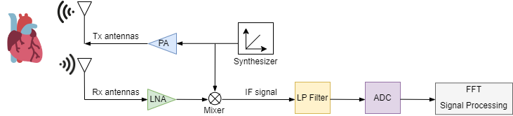

# TAIST_MMwave
 <!-- TABLE OF CONTENTS -->

  
Table of Contents

  <ol>
    <li>
      <a href="#INTRODUCTION">INTRODUCTION</a>
    </li>
    <li>
      <a href="#Fundamentals of mmWave Radar">Fundamentals of mmWave Radar</a>
      <ul>
        <li><a href="#Working Principles">Working Principles</a></li>
        <li><a href="#Basic Pipeline">Basic Pipeline</a></li>
        <li><a href="#mmWave Radar Sensors">Fundamentals of mmWave Radar
      </ul>
    </li>
    <li><a href="#RADAR DATA REPRESENTATIONS">RADAR DATA REPRESENTATIONS</a>
        <ul>
            <li><a href="#Hardware">Hardware</a></li>
                <ul>
                    <li><a href="#IWR1642">IWR1642</a></li>
                    <li><a href="#DCA1000EVM">DCA1000EVM</a></li>
                </ul>
            <li><a href="#Software">Software</a>
                <ul>
                    <li><a href="#Create-ML-Library">Create ML Library</a></li>
                    <li><a href="#Testing-ML-Library">Testing ML Library</a></li>
                    <li><a href="#Final-Deployment">Final Deployment</a></li>
                </ul>
            </li>
        </ul>
    </li>
    
   
  </ol>

## Introduction

<a href="https://drive.google.com/drive/folders/1XOdPlMdZgRdOA13Nl3a8S_WuzcY_C4jY?usp=sharing">Dataset_MMWave</a>

The electrocardiogram (ECG) is the standard diagnostic tool used in clinical medicine to measure various cardiac features. Commercially 
available products have already achieved high-accuracy measurements using contact-based electrode devices. However, these products 
can be unfriendly to patients with burns or dermatosis, are unsuitable for long-term monitoring, and may cause discomfort. Additionally, 
contact sensors increase the risk of infections. Therefore, recently, many researchers  tend to describe processes to extract ECG 
signals from the responses of mmWave radar operating within ICNIRP safety standards . This provides a noninvasive and affordable 
way to monitor cardiac waves. However, a key problem of the new research methods is the reliance on massive amounts of data to train 
and test models. N o t m a n y datasets are publicly available.These datasets are measured with different environmental setup 
and they are difficult to compare. This work aims to create our own datasets that synchronize the radar signals with the ECG signals.
This work mainly focuseson simultaneous recording the ECG signals and the radar signals in two scenarios. The radar sensor is placed 
perpendicular to the chest of a subject at a set distance, while the subjects can be either sitting or lying downas shown in the figure. The 
subject must be informed about the experiment and signed a consent form. mmWave radars at the frequency band 60-80GHz developed 
by Texas Instruments have been used for researches at Kasetsart Advanced RF and Electromagnetics Laboratory (KAREN). The raw 
signals produced by these radars are easily captured for datasets 

## Fundamentals of mmWave Radar

<b>Millimeter wave radar </b> is a type of radar that users very short electromagnetic waves.These short waves allow mmWave radars to detect small movements with high precision. Operating at frequencies between 76 and 81 GHz, mmWave radars can see details as tiny as a fraction of a millimeter.

### Working Principles

  

 

  

When the radar starts working,First the synthesizer generates a linear frequency modulated pulse called a <b>"chirp"</b> which is amplified in power and transmitted by the TX antenna is often represented using both cosine and sine waves because these 2 functions form basic periodic signal

<ul>
<li>the transmitted signal is a sine wave, it can be represented as</li>

$$
S_{tx}(t) = A \sin(2\pi f_c t + \phi_{tx})
$$

Where:

- $ \A $ : Amplitude of the transmitted signal.

- $ \f_c $ : Carrier frequency.

- $ \t $ : Time.

- $ \phi_{tx} $ : Phase of the transmittedsignal.

</ul>

<ul>
<li>The received signal after reflection will also be a sine wave with potential time delay and Doppler shift through a low noise amplifier (LNA) </li>

$$
S_{rx}(t) = A \sin\left(2\pi f_r (t - \tau) + \phi_{tx}\right)
$$
Where:

- $ \ f_r $ : Frequency of the received signal.

- $ \ t $ : Time delay.

- $ \phi_{rx} $ : Phase of received signal.

</ul>

<ul>
<li>Combining the Rx and TX into the mixer to generate the intermediate Frequency (IF) signal</li>

$$
S_{IF}(t) = S_{tx}(t) *  S_{rx}(t)
$$

- Note :

$$
\sin(a) \sin(b) = \frac{1}{2} \left[ \cos(a - b) - \cos(a + b) \right]
$$

</ul>

